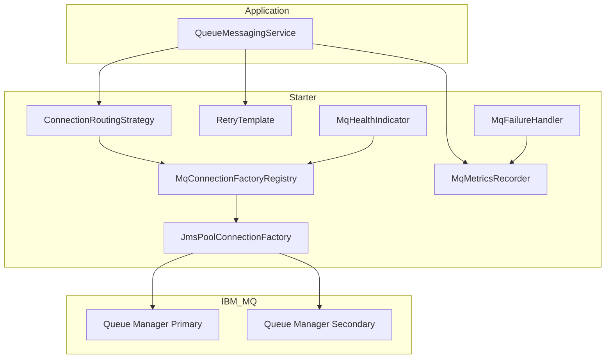

# Spring Boot Starter IBM MQ

Production-ready Spring Boot starter for IBM MQ integration. This library hides JMS and IBM MQ boilerplate so microservices only configure `application.yml` and inject `QueueMessagingService`.

## Technology Stack

| Component | Version |
|-----------|---------|
| Java | 25 |
| Spring Boot | 4.0.6 |
| Spring JMS | Included |
| Jakarta JMS | 3.x |
| IBM MQ Client | 10.0.0.0 (via mq-jms-spring-boot-starter 4.1.0) |
| Spring Retry | 2.0.12 |
| Micrometer | Included |
| OpenTelemetry | API hooks |
| Testcontainers | IBM MQ test support |

## Architecture Overview



### Package Structure

```
com.enterprise.mq.starter
├── config          Auto-configuration
├── properties      Strongly typed @ConfigurationProperties
├── connection      Connection factory registry, pooling, validation
├── routing         Round-robin, failover, priority strategies
├── service         QueueMessagingService, MqFailureHandler
├── producer        JMS producer
├── consumer        JMS consumer
├── converter       Message type conversion (Text, Bytes, Map, Object, JSON)
├── retry           Spring Retry integration
├── health          Actuator health indicator
├── metrics         Micrometer and OpenTelemetry hooks
├── listener        MqFailureListener extension point
├── event           MqFailureEvent
├── exception       Typed exception hierarchy
├── model           Records and DTOs
└── util            Correlation ID, headers, structured logging
```

## Quick Start

### 1. Add Dependency

```xml
<dependency>
  <groupId>com.enterprise.mq</groupId>
  <artifactId>spring-boot-starter-ibm-mq</artifactId>
  <version>1.0.0-SNAPSHOT</version>
</dependency>
```

### 2. Configure application.yml

```yaml
mq:
  enabled: true
  queueManagers:
    - name: primary
      host: mq.example.com
      port: 1414
      queueManager: QM1
      channel: APP.SVRCONN
      username: ${MQ_USER}
      password: ${MQ_PASSWORD}
      priority: 10
      queues:
        - name: ORDERS.IN
          receiveTimeoutMs: 5000
        - name: ORDERS.OUT
  routing:
    strategy: ROUND_ROBIN   # ROUND_ROBIN | FAILOVER | PRIORITY
  retry:
    enabled: true
    maxAttempts: 3
    initialDelayMs: 500
    maxDelayMs: 10000
    multiplier: 2.0
    exponentialBackoff: true
  pool:
    enabled: true
    maxConnections: 10
    reconnectOnException: true
  health:
    enabled: true
    validateQueues: true
  failure:
    publishEvents: true
    logStructuredErrors: true
    incrementMetrics: true
  observability:
    metricsEnabled: true
    structuredLoggingEnabled: true
    correlationIdEnabled: true
    openTelemetryEnabled: true
```

### 3. Send Messages

```java
@Service
public class OrderPublisher {

  private final QueueMessagingService messagingService;

  public OrderPublisher(QueueMessagingService messagingService) {
    this.messagingService = messagingService;
  }

  public void publish(Order order) {
    messagingService.convertAndSend("ORDERS.IN", order);
  }

  public void publishWithHeaders(Order order) {
    MqMessageHeaders headers = MqMessageHeaders.builder()
        .correlationId(UUID.randomUUID().toString())
        .persistent(true)
        .priority(5)
        .customHeaders(Map.of("source", "order-service"))
        .build();
    messagingService.sendWithHeaders("ORDERS.IN", order, headers);
  }
}
```

### 4. Receive Messages

```java
@Service
public class OrderConsumer {

  private final QueueMessagingService messagingService;

  public Optional<Order> poll() {
    MqReceiveResult<Order> result =
        messagingService.receive("ORDERS.IN", Order.class);
    return result.payloadOptional();
  }
}
```

### 5. Request-Reply

```java
Message reply = messagingService.requestReply(
    "ORDERS.IN",
    requestPayload,
    "ORDERS.REPLY",
    5000L);
```

## Multiple Queue Managers

Configure multiple queue managers under `mq.queueManagers`. Each entry supports independent host, port, channel, credentials, priority, and queue definitions.

```yaml
mq:
  queueManagers:
    - name: dc-east
      host: mq-east.example.com
      port: 1414
      queueManager: QMEAST
      channel: APP.SVRCONN
      priority: 10
      queues:
        - name: PAYMENTS.IN
    - name: dc-west
      host: mq-west.example.com
      port: 1414
      queueManager: QMWEST
      channel: APP.SVRCONN
      priority: 5
      queues:
        - name: PAYMENTS.IN
  routing:
    strategy: FAILOVER
```

Use `preferredQueueManager` overloads to target a specific queue manager:

```java
messagingService.send("PAYMENTS.IN", payload, "dc-east");
```

## Routing Strategies

| Strategy | Behavior |
|----------|----------|
| `ROUND_ROBIN` | Distributes load across healthy connections |
| `FAILOVER` | Uses first healthy connection; skips unhealthy |
| `PRIORITY` | Selects highest-priority healthy connection |

### Custom Routing Strategy

Implement `ConnectionRoutingStrategy` and register as a Spring bean:

```java
@Component("geoRoutingStrategy")
public class GeoRoutingStrategy implements ConnectionRoutingStrategy {
  // implementation
}
```

Configure:

```yaml
mq:
  routing:
    customStrategyBean: geoRoutingStrategy
```

## Retry Configuration

Retry uses Spring Retry with exponential backoff:

```yaml
mq:
  retry:
    enabled: true
    maxAttempts: 3
    initialDelayMs: 500
    maxDelayMs: 10000
    multiplier: 2.0
    exponentialBackoff: true
```

Only `RetryableMqException` and its causes trigger retry.

## Health Checks

Actuator endpoint `/actuator/health` includes IBM MQ status:

| Status | Meaning |
|--------|---------|
| `UP` | All queue managers healthy |
| `DEGRADED` | Partial connectivity or queue access issues |
| `DOWN` | All queue managers unavailable |

Health validates:

- Queue manager connectivity
- Channel availability
- Queue accessibility (when enabled)

Example response detail:

```json
{
  "mq": {
    "status": "DEGRADED",
    "details": {
      "primary": {
        "status": "UP",
        "connection": "UP",
        "channel": "APP.SVRCONN",
        "queues": { "ORDERS.IN": "UP" }
      },
      "secondary": {
        "status": "DOWN",
        "connection": "DOWN",
        "reason": "Queue manager connectivity failed"
      }
    }
  }
}
```

## Failure Triggers and Extension Points

When a queue manager or queue becomes unavailable, the starter:

1. Logs structured JSON errors
2. Publishes `MqFailureEvent` Spring application events
3. Invokes registered `MqFailureListener` beans
4. Increments Micrometer counters
5. Updates health status

### Custom Notification Handler

```java
@Component
public class SlackFailureNotifier implements MqFailureListener {

  @Override
  public void onFailure(
      FailureType failureType,
      String queueManagerName,
      String queueName,
      String channelName,
      String message,
      Throwable cause) {
    // Send Slack/PagerDuty/email notification
  }
}
```

### Event Listener

```java
@Component
public class MqFailureEventListener {

  @EventListener
  public void handle(MqFailureEvent event) {
    // React to failure events
  }
}
```

## Observability

### Micrometer Metrics

| Metric | Description |
|--------|-------------|
| `mq.send.success` | Successful sends |
| `mq.receive.success` | Successful receives |
| `mq.retry.count` | Retry attempts |
| `mq.failure.count` | Failures by type |
| `mq.connection.failure` | Connection failures |

### Structured Logging

Operations emit JSON structured logs with `correlationId`, `queueManager`, `queue`, and `event`.

### Correlation IDs

Uses Java 25 `ScopedValue` for correlation ID propagation:

```java
CorrelationIdHolder.runWithCorrelationId("my-correlation-id", () -> {
  messagingService.send("ORDERS.IN", payload);
});
```

### OpenTelemetry

Spans are created for send, receive, and request-reply operations when `mq.observability.openTelemetryEnabled=true`.

## Message Types Supported

| Type | Support |
|------|---------|
| TextMessage | Native |
| BytesMessage | Native |
| MapMessage | Native |
| ObjectMessage | Serializable objects |
| JSON | Automatic via Jackson |

## Environment Variables

All properties support environment variable substitution:

```yaml
mq:
  queueManagers:
    - name: primary
      host: ${MQ_HOST:localhost}
      port: ${MQ_PORT:1414}
      username: ${MQ_USER}
      password: ${MQ_PASSWORD}
```

## Troubleshooting

| Symptom | Likely Cause | Resolution |
|---------|----------------|------------|
| `MqConnectionException` on startup | Wrong host/port/channel | Verify MQ connection parameters |
| Health `DOWN` | Queue manager unreachable | Check network, firewall, MQ listener |
| Health `DEGRADED` | Queue permissions missing | Grant GET/PUT/BROWSE on queue |
| `MqRoutingException` | All connections unhealthy | Check failover queue managers |
| Retries exhausted | Persistent MQ outage | Review retry settings and MQ logs |
| Auth failures | Invalid credentials | Verify USERID/PASSWORD or channel auth |

Enable debug logging:

```yaml
logging:
  level:
    com.enterprise.mq.starter: DEBUG
    com.ibm.msg.client: WARN
```

## Building and Testing

```bash
export JAVA_HOME=/usr/lib/jvm/java-25-openjdk-amd64
mvn clean verify
```

Quality plugins: Checkstyle, PMD, SpotBugs, JaCoCo (90% coverage threshold).

## License

See LICENSE file.
